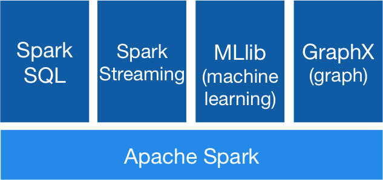

# SPARK

Spark is the future, Spark is right now.  The goal is essentially an end-to-end platform for data science on Big Data, the way sklearn is for small data.  It's not there yet, but it's growing daily.

## What is Spark?

* Spark is a fast and general engine for large-scale distributed data processing.
* Spark can run programs up to 100x faster than Hadoop MapReduce in memory, or 10x faster on disk.
* Spark improves on MapReduce's computation model with an advanced DAG (Directed Acyclic Graph) execution engine that supports cyclic data flow and in-memory computing.
* Spark runs on Hadoop, Mesos, standalone, or in the cloud. It can access diverse data sources including HDFS, Cassandra, HBase, and S3.
* Spark is written in Scala, but has bindings for Java, Python (PySpark), and R
	
### Spark Modules

* Spark SQL - Interact with Spark via SQL interface (like Hive for Hadoop)
* Spark Streaming - Handle streaming data for realtime workflows
* Spark MLLib - Machine Learning in Spark (think sklearn for big data)
* Spark GraphX - Graph processing in Spark



### Spark Concepts

* Resilient Distributed Datasets (RDDs) - How Spark distributes data (in memory!)
* [Spark DataFrames](https://databricks.com/blog/2015/02/17/introducing-dataframes-in-spark-for-large-scale-data-science.html) - Relatively newer interface for working with Spark data in terms of DataFrames, just like Pandas dataframes
* Processes on a Cluster - Similar to Hadoop, Spark launches self-contained processes on workers but this time they can share information
* Lazy - All data transformations in Spark are lazy (think gensim!)
* Interactives Shells - Scala, Python

#### RDD:

The main abstraction Spark provides is a Resilient Distributed Dataset (RDD), which is a fault-tolerant collection of elements partitioned across the nodes of the cluster that can be operated on in parallel.

An example of a RDD: 
```spark
data = [1, 2, 3, 4, 5]   
distData = sc.parallelize(data)
```


Our RDD has an array, that is referencing some partions objects.   The idea is that these partion
objects are serializable and can be spread around the nodes.  For example, if we had a four node cluster,
we would expect that each node would be assigned a partion. 
The partition objects in turn reference memory.  The data is kept in RAM on the various nodes (and this is where we will do our operations by default).  The reason that Spark is extremely effecient at iterative applications is because RDDs can be cached into memory.
    
Note: if we had an 1000 node cluster (but only 4 partitions), we would only be using 4 nodes on our cluster (Of course, we want to pay attention to the # of partitions!)

Also note that the RDDs are an immutable collection of objects. (Why?)  Immutable data is safe to share across processes. 

Reference:  
http://spark.apache.org/docs/latest/cluster-overview.html
    
### Clusters (and their Components)
    
Spark applications run as independent sets of processes on a cluster, (coordinated by a Spark Context (SC) object in your main program (aka driver program))  

1) Node where SC is created is running your driver node   
2) We also have our Cluster Manager (Spark standalone or Yarn/Mesos) ~ aka our Master  
3) In order to run an application, our driver process needs resources; Driver communicates with Master   
4) Master allocates resources - > Workers acquire executors on nodes in the cluster  
(executors ~ processes that run computations and store data for your applications.)   
5) Finally, SC sends tasks for the executors to run.  


### All transformations in Spark are lazy

.. results are not computed right away. 
And spark just remembers that transformations were applied to some base dataset.  The transformations are only computed when an action requires a result to be returned to the driver program. 
This design enables Spark to run more efficiently!


### Interactive Shells:

- bin/spark-shell for the Scala shell
- bin/pyspark for the Python shell
